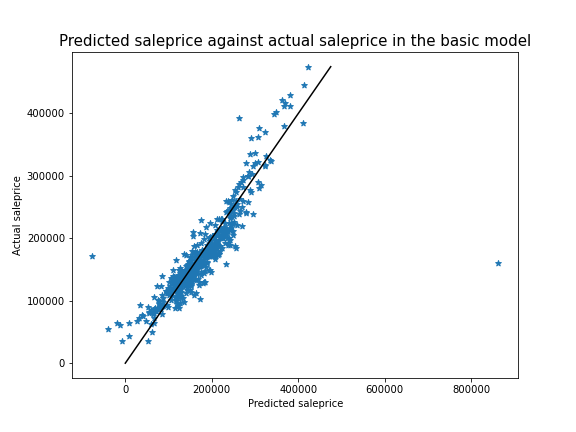
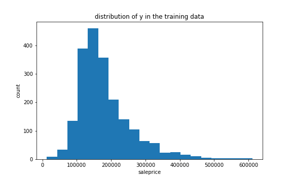
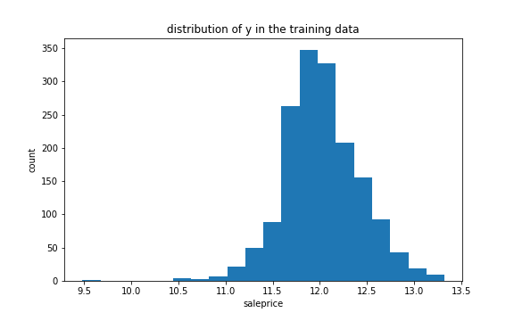
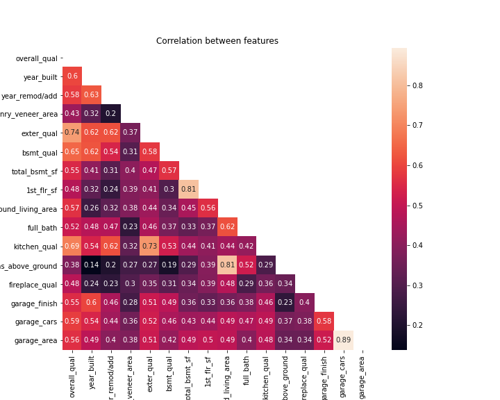
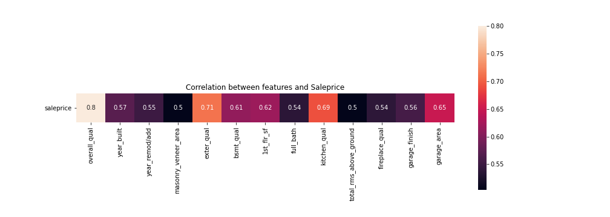
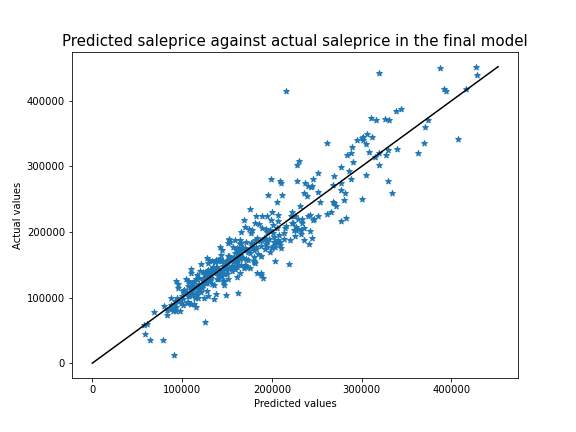
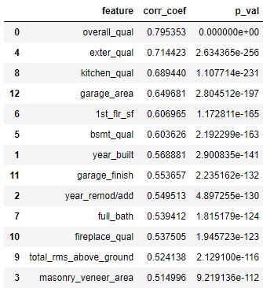
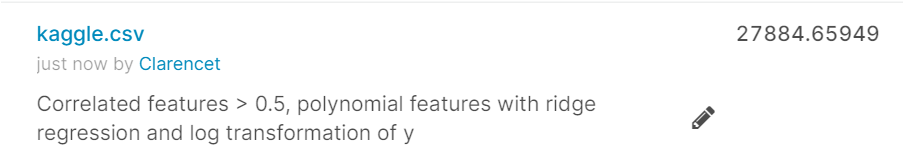

# Overview

Ames is a city in Iowa which is home to more than 65,000 people. It offers recreational, cultural, business, entertainment, and educational amenities. It is home to Iowa State University, and plays a big role in the developing world's bio-economic future[1]. Nearly a half of the city's population was comprised of students of the university in 2019[2]. The headquarters for the Iowa Department of Transportation is also located in Ames[3].  
  
Additionally, Ames is also a center of agriculture, being the city of choice for several of the United States Department of Agriculture (USDA) sites: the largest federal animal disease center in the United States, the Agricultural Research Service's National Animal Disease Center (NADC)[4], one of two national USDA sites for the Animal and Plant Health Inspection Service (APHIS)[5], which comprises the National Veterinary Services Laboratory and the Center for Veterinary Biologics. 

  
Source: City of Ames, IA[6]

--- 

# Problem Statement

With nearly half the population of Ames being university students, the Director of Property Flippers Co. has decided to acquire properties in Ames not only to rent them to students, but with the goal of selling the properties for profit.  

With this in mind, he has sought a consultation on the features which help increase the property value, as well as a model which predicts of the saleprice of properties with these features in order to identify properties which may be undervalued.

---

# Executive summary

### Initial model  

An analysis was conducted to identify the features which had the highest effect on the sales price. Further, a model was created based on the features to predict the sales price given the features of the property with the ideal features.  

  
Although it looks like there is low variance and high accuracy, the initial models did not generalize well to new data. There were highly erroneous predictions (negative or 0 saleprice). 

### Subsequent model

However, after feature engineering, and transformations, the model was more accurate and generalized to new data better.  

As the target, saleprice, was right-skewed, we performed log transformation on it to normalize the distribution.  
  
Before log transformation  
  
After log transformation  

Features which had greater than 0.5 correlation with the target were selected. These features were further trimmed based on their correlation to each other, with those having higher than 0.8 correlation to another feature being dropped.  
  
Heatmap of all correlations  
  
 
Heatmap of final features  
  
The features were transformed with polynomialfeatures, standardscalar, and finally fitted to a ridge regression model.

Eventually, we got the following scores for the train-test-split on our model:  

- The  𝑅2  value of the training data is 0.8608072016630297.  
- The  𝑅2  value of the test data is 0.8312880023020669.  
- The RMSE of the training data is 28200.39083330392  
- The RMSE of the test data is 27478.711633057253  

Based on the  𝑅2  and RMSE scores above, we can see that the train and test scores are now fairly close. The  𝑅2  score is 0.83 for the test data, which means that it can explain 83% of the variance around the mean.  
The accuracy is now higher, and the model was able to generalize well into the new data from the test set.  

The model has a low variance for prediction of prices in the midrange, but as we go to higher sale prices, the variance is higher.  
This may be due to a lack of data for higher priced properties in the training set, and the model can be improved if we train it with more data for higher priced properties.

### Hypothesis testing

Hypothesis testing was conducted using the Pearson's Correlation Coefficient (Pearson's R) test to ensure the scientific accuracy of the analysis.

𝐻0: There is no correlation between the various features in the dataset and sale price  

𝐻0: &rho; = 0   

𝐻𝐴: There is a correlation between the various features in the dataset and sale price 
  
𝐻𝐴: &rho; ≠ 0  

Independent variables:
1. 'overall_qual'  
2.  'year_built'  
3.  'year_remod/add'  
4.  'masonry_veneer_area'  
5.  'exter_qual'  
6.  'bsmt_qual'  
7.  '1st_flr_sf'  
8.  'full_bath'  
9.  'kitchen_qual'  
10. 'total_rms_above_ground'  
11. 'fireplace_qual'  
12. 'garage_finish'  
13. 'garage_area'  

Dependent variables = 'saleprice'

Significance level: 0.385% (adjusted down for the Bonferroni correction)

The Pearsons's R test gave the following results:

---

# Conclusion/Recommendations

1. The p-value from our hypothesis test was small enough for us to reject the null hypothesis and accept the alternative hypothesis that there is a correlation between the various features in the dataset and sales price.  
2. This correlation is between 0.51 and 0.79, which means that as these features were present or of a higher scale / area, the value of the property increased.  
3. The top 13 features are the variables listed in the hypothesis testing.
4. There is a possibility that there are other features which may strongly affec tthe saleprice.  
5. Using these top 13 features, we fitted a regression model to predict the saleprice. This model ended up with an  𝑅2  score of around 0.83 which means it explains the variance of the predicted values around the mean fairly well.  
6. Its RMSE was also lower than the previous models, and there was not a big difference between the train and test RMSE, meaning that it was fairly accurate. It was able to generalize decently to the new data from the test set in the train-test-split.  
7. Hence, we can conclude that this model should perform decently in predicting saleprice for Property Flippers Co as a comparison of whether a house they are considering is undervalued.
8. The model is not as good at predicting higher priced properties, possibly due to a lack of data for higher priced properties in the training set, and the model can be improved if we train it with more data for higher priced properties.

---

## Kaggle submission

---

# Datasets

### Provided Data

We will be using the below datasets:  
  
train.csv  
Training data from the Ames Housing dataset
[Provided by GA as part of the DSI course, originally by Ames, Iowa Assessor's Office](https://www.kaggle.com/c/dsi-us-11-project-2-regression-challenge/data)  
[Data Dictionary](http://jse.amstat.org/v19n3/decock/DataDocumentation.txt)  
Contains all the data from the Ames Housing dataset

test.csv  
Test data from the Ames Housing dataset, where Sales Price has been removed  
[Provided by GA as part of the DSI course, originally by Ames, Iowa Assessor's Office](https://www.kaggle.com/c/dsi-us-11-project-2-regression-challenge/data)  
[Data Dictionary](http://jse.amstat.org/v19n3/decock/DataDocumentation.txt)  
Contains all the data from the Ames Housing dataset without the Sales prices

### Data Dictionary

With the exception of features where the column names were changed, the rest of the data follows the definitions in the [Ames Housing Data Dictionary](http://jse.amstat.org/v19n3/decock/DataDocumentation.txt).

|Feature|Type|Dataset|Description|
|:---|---|---|---|
|**street_type**|object|train and test|(Nominal) Type of road access to property|
|**alley_type**|object|train and test|(Nominal) Type of alley access to property|
|**proximity_road_railroad_1**|object|train and test|(Nominal) Proximity to various conditions|
|**proximity_road_railroad_2**|object|train and test|(Nominal) Proximity to various conditions (if more than one is present)|
|**exterior_mat_1**|object|train and test|(Nominal) First type of exterior covering on house|
|**exterior_mat_2**|object|train and test|(Nominal) Second type of exterior covering on house (if more than one material)|
|**masonry_veneer_type**|object|train and test|(Nominal) Masonry veneer type|
|**masonry_veneer_area**|float|train and test|Masonry veneer area in square feet|
|**above_ground_living_area**|int|train and test|Above ground living area in square feet|
|**total_rms_above_ground**|int|train and test|Total number of rooms above ground (does not include bathrooms)|
|**fireplace_qual**|float|train and test|(Ordinal) Fireplace quality, from 0-5, 0 being none and 4 being the best|
|**three_season_porch**|int|train and test|Three season porch area in square feet|
|**pool_qual**|float|train and test|(Ordinal) Pool quality, from 0-4, 0 being none and 4 being the best|
|**foundation_type**|object|train and test|(Nominal) Type of foundation, as per Ames data dictionary|
|**fence_type**|float|train and test|(Ordinal) Fence quality, from 0-4, 0 being none and 4 being the best|
|**heating_type**|object|train and test|(Nominal) Type of heating system|
|**electrical_system**|float|train and test|(Ordinal) Electrical system type, from 1-5, 1 being mixed and 5 having the best systems|
|**misc_value**|int|train and test|$Value of miscellaneous feature|
|**month_sold**|int|train and test|Month the property was sold|
|**year_sold**|int|train and test|Year the property was sold|

  
---

# Data Handling Summary  

1. Converted column names to snake case
2. For columns with dtype 'float', NaNs were filled with 0, with the exception of garage_year_built.
3. For columns with dtype 'object', NaNs were filled with 'None'.
4. Many column names were renamed for better clarity as per above data dictionary.
5. 'garage_yr_blt' was dropped as a feature.
6. 'id' and 'pid' were dropped from the models.
7. Categorical features were classified as ordinal and nominal.
8. Ordinal features were given numerical values in an ascending scale (higher being better).
9. Nominal features were transformed with one-hot-encoding.
10. test.csv and train.csv were saved as test2.csv, test3.csv, train2.csv, and train3.csv according to the changes made.
11. Multiple features were filtered out to only select features with correlation of over 0.5 with saleprice.
12. Features with high correlation with each other were dropped.
13. Polynomial features were created.
14. The data was scaled using standardscaler.
15. Target y was log-transformed.
16. Final predicted values were exponent-transformed to fit the original format.

---

# References  

[1] City of Ames, IA, “About Ames,” 2021. [Online]. Available: [https://www.cityofames.org/about-ames/about-ames](https://www.cityofames.org/about-ames/about-ames). [Accessed: 03-Apr-2021].  
[2] Iowa State University, Office of the Registrar, "Final Enrollment - Fall 2019," 10-Sep-2019. [Online]. Available: [https://www.registrar.iastate.edu/sites/default/files/uploads/stats/university/Final.Enrollment-Fall.2019.pdf](https://www.registrar.iastate.edu/sites/default/files/uploads/stats/university/Final.Enrollment-Fall.2019.pdf). [Accessed: 03-Apr-2021]  
[3] Iowa Department of Transportation, "About the DOT," n.d. [Online]. Available: [https://web.archive.org/web/20210118112524/iowadot.gov/about](https://web.archive.org/web/20210118112524/iowadot.gov/about). [Accessed: 03-Apr-2021]  
[4] Agricultural Research Service, U.S. Department of Agriculture, "National Animal Disease Center: Ames, IA," n.d. [Online]. Available: [https://www.ars.usda.gov/midwest-area/ames/nadc/](https://www.ars.usda.gov/midwest-area/ames/nadc/). [Accessed: 03-Apr-2021]  
[5] Aphis, USDA, "USDA - Animal and Plant Health Inspection Service (APHIS) - Animal Health - Veterinary Services," 13-Aug-2009. [Online]. Available: [https://web.archive.org/web/20110915182800/http://www.aphis.usda.gov/animal_health/lab_info_services/](https://web.archive.org/web/20110915182800/http://www.aphis.usda.gov/animal_health/lab_info_services/). [Accessed: 03-Apr-2021]  
[6] Ames Chamber of Commerce, n.d. [Online]. Available: [https://livability.com/sites/default/files/1Reiman%20Gardens.JPG](https://livability.com/sites/default/files/1Reiman%20Gardens.JPG). [Accessed: 07-Apr-2021] 
